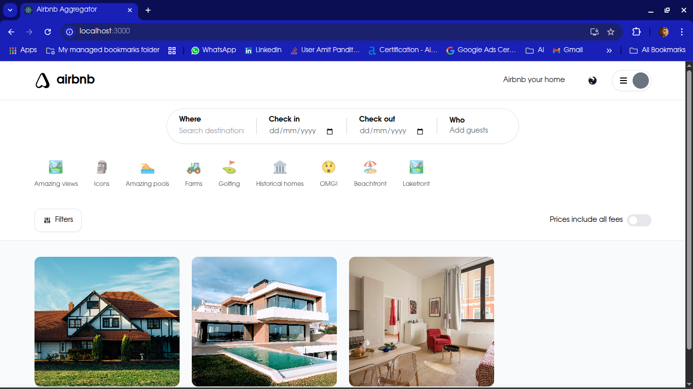
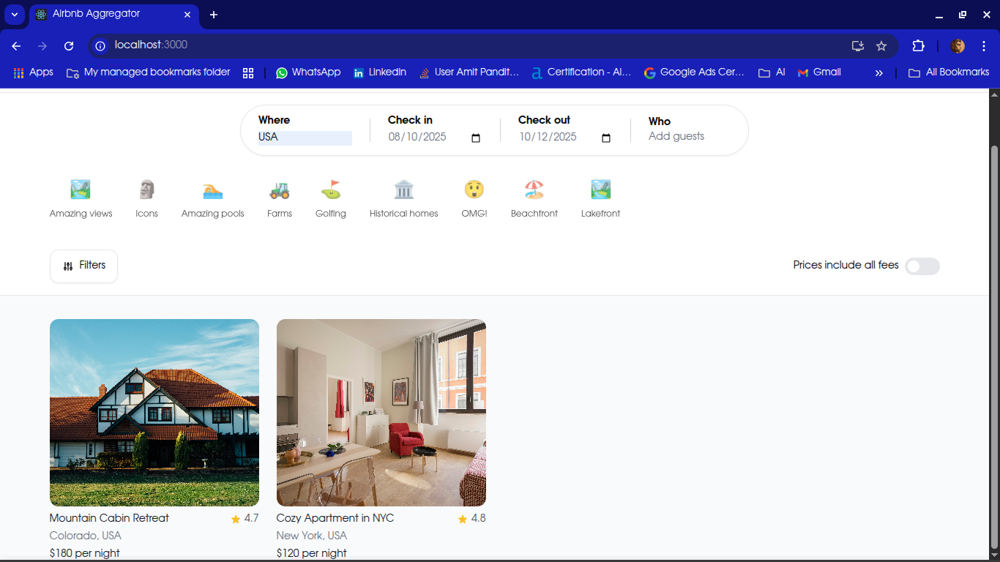
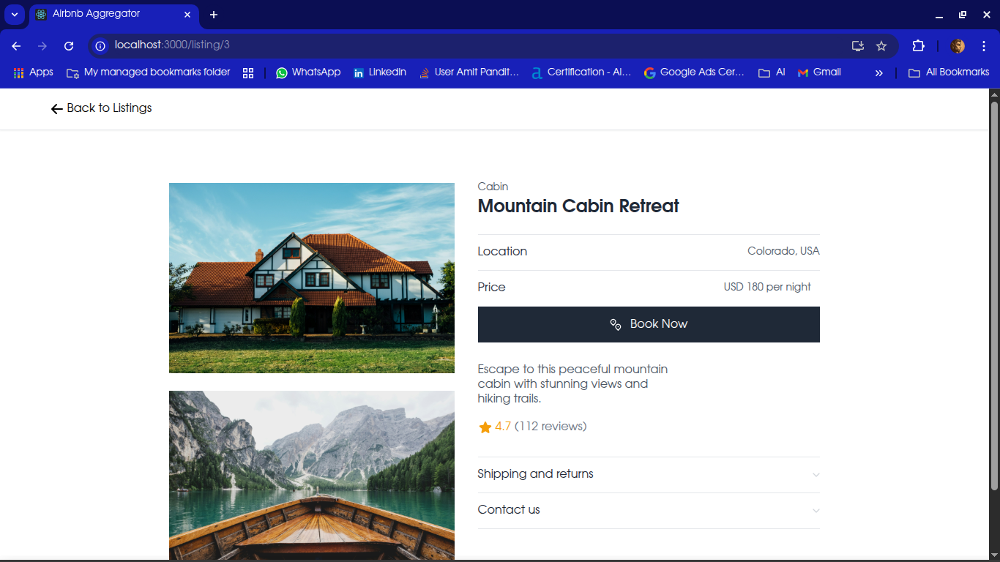

# Airbnb Listings Aggregator

A full-stack web application that aggregates and displays Airbnb-style listings with a modern tech stack, featuring web scraping, data storage, and a beautiful user interface.

## 🚀 Features

- **Data Collection**
  - Scrapy-based web crawler for efficient data gathering
  - Detailed extraction of listing information
  - Automatic submission to backend API
  - Sample data loading option for testing

- **Backend API**
  - Django REST Framework for robust API endpoints
  - MySQL database for reliable data storage
  - Advanced filtering and search capabilities
  - Pagination for handling large datasets

- **Frontend Interface**
  - React.js with pixel-perfect Airbnb UI recreation
  - Tailwind CSS for responsive styling
  - Interactive search and filtering
  - Detailed listing views

## 🛠️ Tech Stack

- **Backend**
  - Django 5.0.2
  - Django REST Framework 3.14.0
  - MySQL
  - django-cors-headers

- **Frontend**
  - React.js
  - Tailwind CSS
  - React Router
  - Axios

- **Data Collection**
  - Python 3.8+
  - Scrapy
  - Requests
  - BeautifulSoup4

## 📋 Prerequisites

- Python 3.8+
- Node.js 14+
- MySQL
- pip
- npm

## 🚀 Installation & Setup

### Quick Start Guide

1. Clone the repository
2. Set up each component:
   - Backend: `cd backend && pip install -r requirements.txt`
   - Frontend: `cd frontend/airbnb-frontend && npm install`
   - Scraper: `cd scraper && pip install -r requirements.txt`
3. Configure the MySQL database
4. Start the components in order:
   - Backend: `cd backend && python manage.py runserver`
   - Scraper: `cd scraper && python load_sample.py` (to load sample data)
   - Frontend: `cd frontend/airbnb-frontend && npm start`

### Detailed Setup Instructions

See each component's README file for detailed setup instructions:
- [Backend README](backend/README.md)
- [Frontend README](frontend/airbnb-frontend/README.md)
- [Scraper README](scraper/README.md)

## 🔄 Project Architecture

This application follows a three-tier architecture:

1. **Data Collection Layer (Scraper)**
   - Collects listing data from Airbnb
   - Processes and cleans the data
   - Submits data to the backend API

2. **Data Management Layer (Backend)**
   - Stores listing data in MySQL database
   - Provides API endpoints for data retrieval
   - Handles filtering and pagination

3. **Presentation Layer (Frontend)**
   - Displays listings in an Airbnb-like interface
   - Provides search and filtering capabilities
   - Shows detailed listing information

The components communicate through well-defined interfaces:
- Scraper → Backend: POST requests to add listings
- Frontend → Backend: GET requests to retrieve listings

## 🌟 Key Features Explained

### Data Collection Process

The scraper component uses Scrapy to efficiently crawl Airbnb listings:
1. Target a specific location, date range, and guest count
2. Extract detailed information from each listing
3. Submit the data to the backend via POST requests

### Backend API Capabilities

The Django REST Framework API provides:
1. Comprehensive listing management
2. Advanced filtering options
3. Paginated responses for efficient data transfer

### Frontend User Experience

The React frontend offers:
1. A pixel-perfect recreation of Airbnb's UI
2. Interactive search and filtering
3. Responsive design for all devices

## 📝 Usage Examples

### Scraping and Storing Data

```bash
cd scraper
source .venv/bin/activate
scrapy crawl airbnb -a location="New-York--NY" -a checkin="2024-05-01" -a checkout="2024-05-07" -a guests=2
```

### Retrieving Filtered Listings

```
GET http://localhost:8000/api/listings/?location=New%20York&min_price=100&max_price=300&min_rating=4
```

## 📸 Screenshots

### Home Page


### Search Results Page


### Listing Details Page


## ⚠️ Notes

- This project is for educational purposes only
- Respect Airbnb's terms of service when using the scraper
- For production deployment, configure proper security measures
- Ensure all components are running for full functionality

## 🤝 Contributing

1. Fork the repository
2. Create your feature branch (`git checkout -b feature/AmazingFeature`)
3. Commit your changes (`git commit -m 'Add some AmazingFeature'`)
4. Push to the branch (`git push origin feature/AmazingFeature`)
5. Open a Pull Request

## 📝 License

This project is licensed under the MIT License - see the [LICENSE](LICENSE) file for details.
